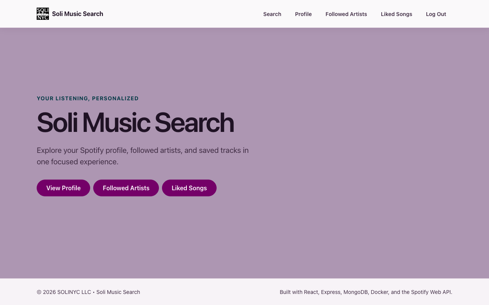
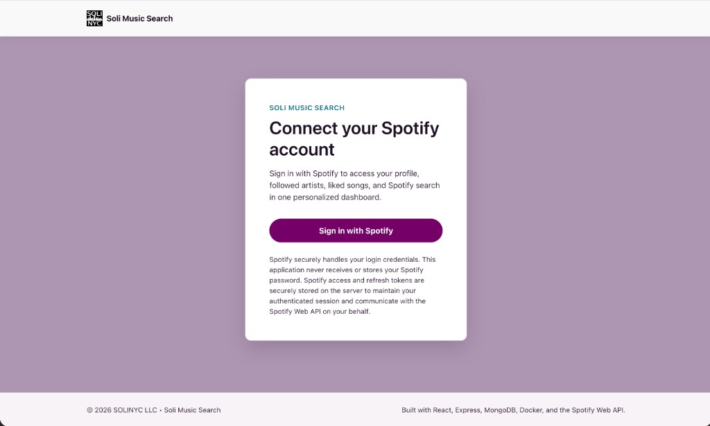
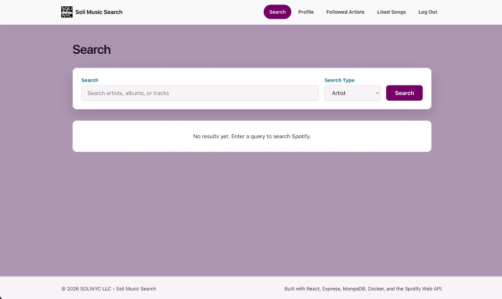
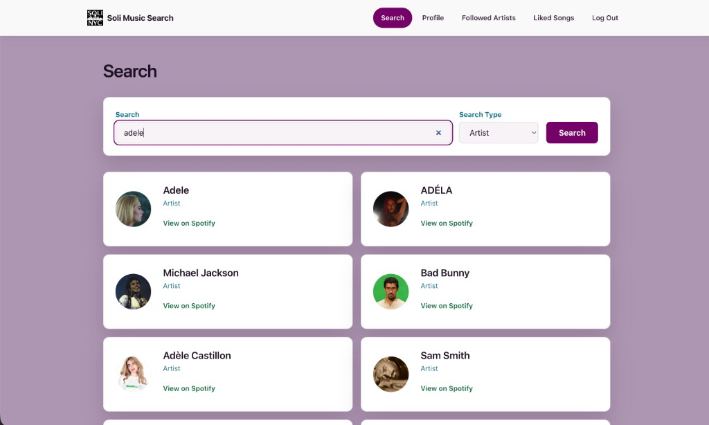
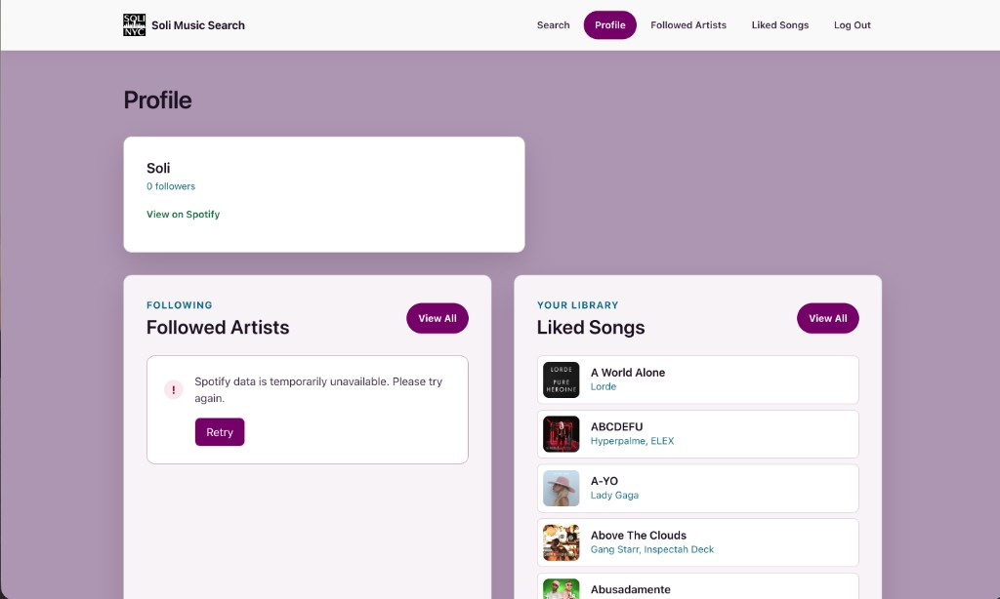
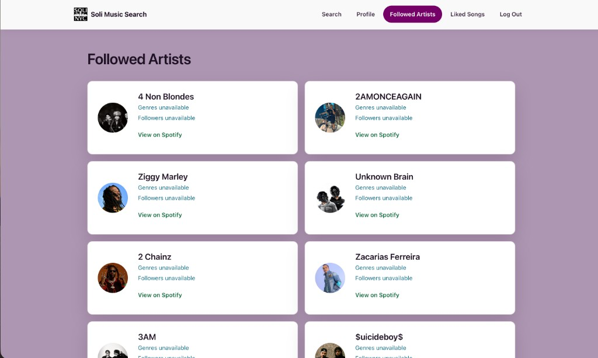
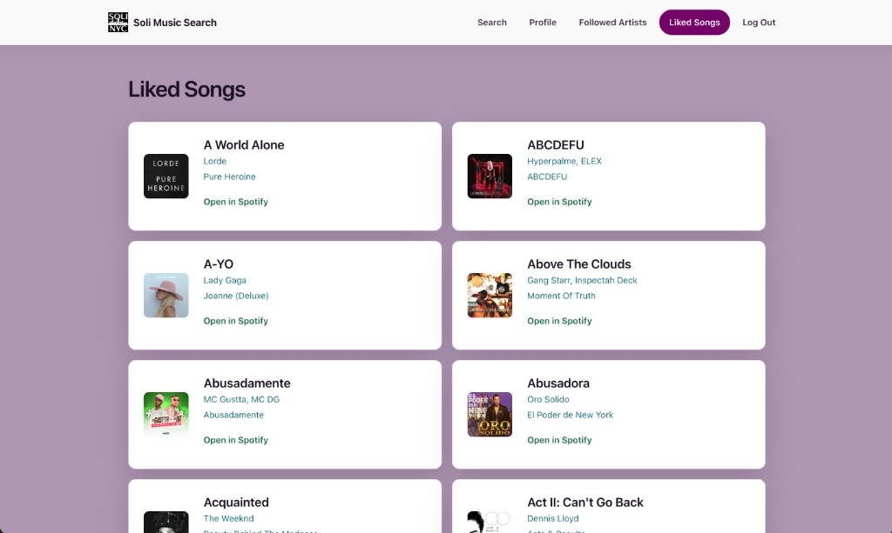
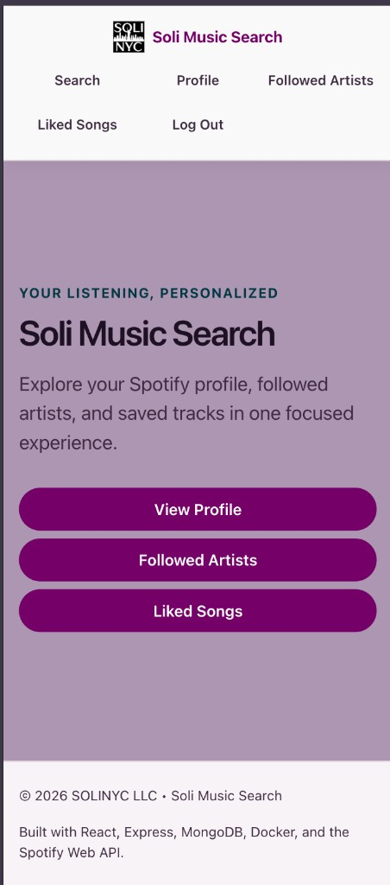

# 🎵 Soli Music Search

A full-stack music search application built with React, Express, MongoDB, Docker, and the Spotify Web API.

This project is being developed as part of Full Sail University's Advanced Server Side Languages course using an Agile workflow throughout the duration of the project.

Users sign in with Spotify using OAuth 2.0 to securely access Spotify Search, their profile, followed artists, and Liked Songs (saved tracks). Spotify access and refresh tokens are stored in MongoDB so authentication persists across normal Docker restarts, and users can Log Out to remove the stored authentication record.

## 📸 Application Preview

### Homepage



### Sign In



### Search Interface



### Search Results



### Profile



### Followed Artists



### Liked Songs



### Mobile Layout



## ✨ Features

### ✅ Completed

#### Week 1

- Express backend
- 🐳 Docker development environment
- Environment variable configuration
- Project documentation
- GitHub Issues
- GitHub Milestones
- GitHub Project board

#### Week 2

- 🎧 Spotify Developer application
- 🔒 Spotify OAuth Authorization Code Flow
- Spotify login endpoint
- Spotify callback endpoint
- MongoDB token persistence
- Authentication status endpoint

#### Week 3

- 🔒 Spotify OAuth authentication
- MongoDB token persistence
- 🔄 Automatic access-token refresh
- Authentication status endpoint
- 🎧 Spotify profile endpoint
- 🎧 Spotify followed artists endpoint
- 🎧 Spotify saved tracks endpoint
- Required OAuth scopes (`user-follow-read`, `user-library-read`)
- ✅ Live endpoint validation completed

#### Week 4

- React frontend application
- 🔒 Protected authentication flow
- 🎧 Spotify Profile page
- 🎧 Followed Artists page
- 🎧 Liked Songs page
- Shared application layout
- SOLINYC-inspired responsive UI
- Responsive navigation
- Shared loading, error, and empty state components
- Profile dashboard previews
- ✅ Frontend validation completed

#### Final Assignment Correction

- 🎧 Spotify search endpoint (`GET /api/spotify/search`)
- Artist search
- Album search
- Track search
- 🔒 Protected `/search` route
- Authenticated redirect to `/` after login
- Authenticated `/login` redirect to `/`
- Visible **No results** state before search and for zero matches
- Clickable result thumbnails using Spotify Web Player links (`external_urls.spotify`)

#### Session Controls

- Logout endpoint (`POST /auth/logout`)
- Authenticated navigation **Log Out** control
- Logout removes the stored Spotify token record from MongoDB
- Redirect to `/login` after logout
- Authentication remains persistent across ordinary Docker restarts

### ⏳ Planned

- Favorites
- Playlists
- Recently Played
- Listening insights
- Music player integration

## 🛠️ Technology Stack

### Backend

- Node.js
- Express
- MongoDB
- Mongoose

### Frontend

- React
- Vite

### 🔒 Authentication

- 🎧 Spotify OAuth 2.0 Authorization Code Flow

### Infrastructure

- 🐳 Docker
- Docker Compose

### Development

- Git
- GitHub
- GitHub Issues
- GitHub Milestones
- GitHub Projects

## 📁 Project Structure

```text
pp3-spotify-app/
│
├── backend/
│   ├── config/
│   ├── models/
│   ├── services/
│   ├── index.js
│   └── package.json
│
├── frontend/
│   ├── public/
│   ├── src/
│   │   ├── components/
│   │   ├── context/
│   │   ├── layouts/
│   │   ├── pages/
│   │   ├── routes/
│   │   ├── services/
│   │   ├── styles/
│   │   ├── App.jsx
│   │   └── main.jsx
│   ├── index.html
│   ├── package.json
│   └── vite.config.js
│
├── docker-compose.yml
└── README.md
```

## 🚀 Running the Project

Clone the repository:

```bash
git clone https://github.com/OlivaresStephanie-FS/SpotifyPrototype.git
```

Start the development environment:

```bash
docker compose up
```

Open your browser:

```text
http://localhost:3000
```

## 🔑 Environment Variables

Create a `.env` file inside the `backend` directory.

```env
SPOTIFY_CLIENT_ID=
SPOTIFY_CLIENT_SECRET=
SPOTIFY_REDIRECT_URI=
MONGODB_URI=
PORT=3000
NODE_ENV=development
FRONTEND_URL=http://localhost:5173
SESSION_SECRET=
```

`FRONTEND_URL` is the frontend origin used for post-OAuth redirects and for CORS. In local Docker development the Vite proxy remains the primary path for API calls; in production set this to the public frontend origin (for example `https://music.soli.nyc`) so the Netlify frontend can call the Render backend.

`MONGODB_URI` is the only database configuration the backend reads. Local Docker Compose should continue using the `spotify-mongo` container URI (see `backend/.env.example`). For production, set `MONGODB_URI` to your MongoDB Atlas connection string (typically a `mongodb+srv://...` URI). Do not commit Atlas credentials to the repository.

`SESSION_SECRET` signs the HTTP-only session cookie that binds each browser to its own Spotify account. Production must use a long, random value configured in Render. Do not commit a real secret.

## 🔐 Authentication Flow

1. User navigates to `/login` and chooses **Sign in with Spotify**.
2. The backend creates a browser session, stores OAuth `state` in that session, and redirects to Spotify.
3. User authorizes the application.
4. Spotify redirects the user to `/callback` with an authorization code and `state`.
5. The backend validates `state`, exchanges the code for tokens, loads the Spotify user profile, and stores tokens in a user-specific MongoDB record keyed by Spotify user ID.
6. The Spotify user ID is saved on the current browser session (HTTP-only cookie). Tokens are never sent to the frontend.
7. Authentication status can be checked using `/auth/status` for the current session only.
8. Authenticated users can log out with **Log Out**, which destroys only that browser session, clears its cookie, and deletes only that user’s stored Spotify token record.
9. MongoDB Docker volume persistence keeps data available across ordinary `docker compose down` / `docker compose up` and container restarts until the user explicitly logs out.

## 📡 Current API Endpoints

| Method | Endpoint                    | Description                            |
| :----: | --------------------------- | -------------------------------------- |
|  GET   | `/`                         | Health check                           |
|  GET   | `/login`                    | Redirect user to Spotify authorization |
|  GET   | `/callback`                 | Spotify OAuth callback                 |
|  GET   | `/auth/status`              | Returns current authentication status  |
|  POST  | `/auth/logout`              | Clears stored Spotify tokens (idempotent logout) |
|  GET   | `/api/spotify/profile`          | Current Spotify user profile           |
|  GET   | `/api/spotify/followed-artists` | Artists the current user follows       |
|  GET   | `/api/spotify/saved-tracks`     | Tracks saved in the user's library     |
|  GET   | `/api/spotify/search`           | Search artists, albums, or tracks      |

## 🎧 Week 3 — Personalized Spotify Dashboard API

Week 3 delivers a personalized Spotify dashboard backend: OAuth authentication, MongoDB token persistence with automatic access-token refresh, authentication status validation, and live Web API routes that return successful Spotify responses.

Key features implemented:

- 🔒 Spotify OAuth authentication with required scopes (`user-read-private`, `user-read-email`, `user-follow-read`, `user-library-read`)
- MongoDB access and refresh token persistence
- 🔄 Automatic access-token refresh via a shared token service
- Authentication status endpoint (`GET /auth/status`)
- 🎧 Current user profile (`GET /api/spotify/profile`)
- 🎧 Followed artists (`GET /api/spotify/followed-artists`)
- 🎧 Saved tracks (`GET /api/spotify/saved-tracks`)
- ✅ Live endpoint validation against the Spotify Web API

## 🎵 Week 4 — React Frontend & Spotify Dashboard

Week 4 delivers a React and Vite frontend for the personalized Spotify dashboard. Protected routing connects the existing Spotify authentication flow to responsive Search, Profile, Followed Artists, and Liked Songs pages within a shared application layout.

Key features implemented:

- React + Vite frontend application
- 🔒 Protected routing for authenticated dashboard pages
- 🎧 Spotify Search page
- 🎧 Spotify Profile page
- 🎧 Followed Artists page
- 🎧 Liked Songs page backed by Spotify's Saved Tracks endpoint
- Sign in with Spotify and authenticated navigation **Log Out**
- Profile dashboard previews for followed artists and liked songs
- SOLINYC-inspired responsive theme
- Shared loading, error, and empty states
- 🐳 Integration with the existing Docker development environment
- ✅ Frontend production build validation

## 🎯 Portfolio Improvement

The application originally displayed Spotify's Top Artists and Top Tracks using Spotify's affinity endpoints. During portfolio validation, these endpoints frequently returned empty results for newer Spotify accounts because Spotify only generates affinity data after sufficient listening history.

To improve the user experience while still demonstrating authenticated Spotify Web API integration, the application now uses:

- Followed Artists
- Liked Songs (Spotify Saved Tracks)

These endpoints provide real user-library data as soon as a user follows artists or saves tracks. This produces a more representative portfolio demonstration for both new and established Spotify users.

### Engineering rationale

The objective of the project is to demonstrate:

- OAuth authentication
- Protected routes
- Authenticated Spotify Web API requests
- Personalized user-data rendering
- A responsive React UI
- Loading and error-state handling

Followed Artists and Liked Songs satisfy all of these project objectives while providing meaningful data without depending on Spotify affinity-history generation.

### Technical changes

The OAuth scope requirements changed from:

```text
user-top-read
```

to:

```text
user-follow-read
user-library-read
```

The existing profile scopes remain in place:

```text
user-read-private
user-read-email
```

Additional implementation changes:

- Top Artists was replaced with Followed Artists.
- Top Tracks was replaced with Liked Songs.
- Profile dashboard previews now display followed artists and liked songs.
- Navigation labels were updated to match the new features.
- The `/saved-tracks` frontend route intentionally remains unchanged because it maps directly to Spotify's Saved Tracks API endpoint, while the interface uses Spotify's consumer-facing term **Liked Songs**.

### Additional UI improvements

- Artist follower counts are read from `artist.followers.total`.
- Large follower counts use compact formatting such as `1.2M` and `842K`.
- Up to three genres are displayed from `artist.genres` when available.
- Graceful fallback text is shown when Spotify omits optional follower or genre data.

### Validation

The application was re-authorized with `user-follow-read` and `user-library-read` and verified against a real Spotify account. Followed Artists, Liked Songs, profile dashboard previews, navigation, authenticated API access, loading states, and error handling were validated with live user-library data.

## 🔍 Spotify Search

The final assignment correction adds authenticated Spotify Search while preserving the existing SOLINYC branding and portfolio library pages (Profile, Followed Artists, Liked Songs).

### Backend

- Authenticated endpoint: `GET /api/spotify/search?q=&type=`
- Supported types: `artist`, `album`, `track`
- Reuses the existing Spotify token persistence and refresh service
- Spotify access and refresh tokens remain server-side only
- Results are normalized to include `id`, `name`, `type`, `image`, `subtitle`, and `external_urls.spotify`

### Frontend

- Protected route: `/search`
- Search input, type selector, search button, loading state, error state, and results list
- Search navigation item added to the existing header
- Visible **No results** message before any search and when Spotify returns zero matches
- Every result thumbnail links to Spotify Web Player via `external_urls.spotify` (`target="_blank"`, `rel="noopener noreferrer"`)

### Authentication redirects

- Successful OAuth callback redirects to `/` (authenticated homepage)
- Authenticated visits to `/login` redirect to `/`
- Existing Spotify token persistence is unchanged (no application JWT)

## 🔒 Session Controls

Authenticated users can end their session with the **Log Out** control in the primary navigation.

- Backend: `POST /auth/logout` destroys the current browser session and deletes only that user’s stored Spotify token record
- Logout is scoped to the current session; other signed-in browsers remain authenticated
- Token values are never returned to the frontend
- After a successful logout, the frontend clears auth state and redirects to `/login`
- Protected routes (`/search`, `/profile`, `/followed-artists`, `/saved-tracks`) require authentication again
- Ordinary Docker restarts (`docker compose down` / `docker compose up`) do **not** log the user out while a valid session cookie and token record remain
- Explicit logout removes that browser’s session and that user’s stored authentication record

## 📌 Agile Workflow

Development is managed using:

- GitHub Issues
- GitHub Milestones
- GitHub Projects
- Feature branches

Each weekly assignment is developed in its own feature branch before being merged into the `development` branch.

## 🚀 Next Steps

- Favorites
- Playlists
- Recently Played
- Listening insights
- Music player integration

## 👩‍💻 Author

**Stephanie Olivares**

Full Stack Web Developer

SOLINYC LLC
